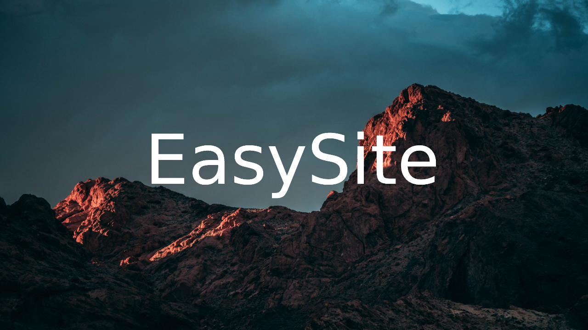

## Fonctionnalités
- Créez votre site en codant réellement, utile pour les nouveaux développeurs Web.
- Utilisez des bibliothèques personnalisés ou WordPress (inclut) pour améliorer votre code.
- Obtenez un code de base pour gagner en efficacité.
## Informations
Cette nouvelle version d'EasySite est disponible non pas sur le compte `enioaiello` mais sur ce compte (afin de faire de l'espace sur l'ancien service).\
Cette version apporte également moins de fonctionnalités : elle est donc plus rapide à télécharger.\
La dernière version du logiciel peut-être téléchargé [ici](https://github.com/thetruefrag/EasySite/releases/latest), vous pouvez néanmois trouver l'ancien projet [ici](https://enioaiello.github.io/EasySite).
## Statistiques
  
